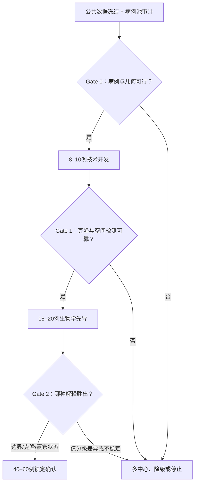

# 结直肠癌前病变后续分析计划 v1.8

日期：2026-07-30  
承接版本：v1.7；本版完成资源闭合、E1 可识别性、反污染和主估计量修订  
计划状态：阶段闸门版；正式队列启动前仍需完成公共数据冻结、病例池审计和技术试点

## 一、路线结论

后续工作的旗舰问题确定为：

> **在同一宿主、同一病理级别和腺体克隆关系被控制后，HGD 边界周围形态学仍为 LGD 的腺体，是否存在随边界距离变化的上皮—间质—免疫状态；这种变化究竟来自局部边界效应、克隆扩张，还是整枚“赢家病灶”的固有状态？**

本计划不再把 E6、通用免疫低下、oncofetal/APM–TRM 失配或单个显著基因作为既定机制。当前最值得优先验证的分子方向是 **TGFβ–ECM/上皮—间质重塑**，但它只是暂定首要机制轴，必须通过公共数据稳健性检查和 15–20 例生物学先导后才能锁为正式研究主终点。

整个项目采用“竞争解释＋阶段淘汰”，而不是围绕一个签名不断调参。

| 竞争解释 | 预期观察 | 若成立时的研究主线 |
|---|---|---|
| 局部 HGD 边界效应 | W-L 的状态随距 HGD 边界连续衰减；校正克隆关系后仍存在 | 克隆锚定的 HGD 边界场 |
| 克隆扩张效应 | 分子状态主要随是否与 W-H 同克隆变化；距离效应校正后消失 | 高级化相关克隆扩张与表型转换 |
| 整枚赢家病灶状态 | W-L-far 与另一枚同步 B-L 仍不同，但 W-L 内部距离梯度弱 | 同宿主赢家—旁观者病灶状态 |
| 宿主场效应或无特异信号 | W-L 与 B-L 相近，或所有信号均由病理重分级、批次、细胞比例解释 | 降级为资源/方法研究或停止旗舰 |

## 二、必须守住的证据边界

1. 横断面三联体不能证明“LGD 状态在时间上先于 HGD”；只能证明它与 HGD 边界或赢家病灶伴随。
2. 患者是主要推断单位；区域、腺体、ROI 和单细胞不能被当作独立患者扩大样本量。
3. 共享 APC/KRAS 等热点或相似 CNA 只能提供谱系线索，不能单独定义同一克隆。
4. GSE128433 中来源标签冲突的 `ln` 样本不得用于淋巴结相关结论。
5. T1 GeoMx 中未复现的 APM–TRM/可塑性失配不得重新包装成既定机制。
6. E6 及其拆分轴只能作为候选读出，不能重新训练成风险评分。
7. 公共数据可以冻结机制轴、评估阶段特异性和克隆度量，但不能代替本院的真实边界距离采样。

## 三、总体样本与空间设计

### 3.1 病例结构

每名患者优先形成以下组合：

- `W-H`：包含 HGD 的赢家病灶内 HGD 区；
- `W-L-near`：赢家病灶内、最靠近 HGD 边界的 LGD；
- `W-L-mid`：赢家病灶内中间距离的 LGD；
- `W-L-far`：赢家病灶内远离 HGD 边界的 LGD；
- `B-L`：同一患者另一枚同步、形态学匹配的 LGD 病灶；
- 可选 `N`：同患者正常黏膜，仅用于场效应和基线敏感性分析，不作为旗舰启动的必要条件。

正式阶段每个区域暂计划分离 2–3 个腺体，但该数量不能直接假定足以代表多克隆区域。技术试点最初 5 例须在关键区域各取 8–12 个腺体进行克隆饱和度试验；只有当增采腺体不再实质改变主克隆归属时，后续病例才可降为每区 2–3 个腺体。RNA 和 mIF 读出尽量与同一腺体或可验证配准的相邻切片坐标对齐。

E1 的“有克隆锚点”与“可估计同克隆距离斜率”分开判定。每名 E1 患者必须至少有 2 个独立的 strong/moderate same-clone W-L 距离位置（优先 >=3），且两位置之间的距离跨度超过 `D_min`；`D_min` 只由技术阶段的距离测量误差和腺体尺度冻结。

### 3.2 距离定义

- 正式分析把数字切片上“腺体到 HGD 边界的最短组织内距离”作为连续变量。
- near/mid/far 只用于取材和结果展示，不作为唯一统计定义。
- 分箱阈值须在 8–10 例技术试点后，根据真实组织几何和可重复标注范围一次性冻结。
- 暂定主距离变换为 `log2(1 + 距离/mm)`，以允许局部效应随距离衰减；最终形式只可根据技术试点的几何量程冻结，不能根据生物学显著性选择。
- W-H 与 W-L 的病理等级不同，W-H 不能被当作“距离为 0 的 LGD”直接并入梯度模型。
- 碎片化、烧灼严重、方向无法还原或 HGD/LGD 边界无法可靠描画的病例不进入主分析。

### 3.3 病例范围

主研究优先纳入散发性、非浸润性腺瘤内 HGD；已知 FAP、Lynch、炎症性肠病相关病变和明确锯齿通路病变应预先排除或单独分层。包含浸润癌的病例可作为外部延伸，不与主队列混合推断。

### 3.4 near-L 反污染与跨层病理安全规则

1. near-L 不是“紧贴 HGD 的第一排腺体”。L2 先冻结 `HGD exclusion buffer = max(2×P95 跨层配准误差, 1 个典型腺体直径)`，buffer 内组织不进入 E1。
2. 所有拟进入 E1 的 near-L 边界区必须由第二名胃肠病理医师独立复核；总体 20% 重复标注用于一致性评价，但不能替代 near-L 的全量双人复核。
3. 分子取材层组采用前后 `sandwich H&E`：在分子切片组前后各保留/染一张 H&E，确认跨层后该坐标仍为纯 LGD；若出现 HGD、疑似 HGD 或不可判定，则该坐标退出主要 E1。
4. W-H 建立 HGD-private 多事件集合。near-L 若只出现接近 LOD、呈成组低比例且与配准/组织学提示一致的 HGD-private 事件，标记 `possible_hgd_admixture`；此类事件不得单独用于提升 clone_support。
5. 阴性伪边界不能随意画线，必须在病灶拓扑、距组织边缘、可用黏膜长度和局部组织质量上尽量匹配真实 HGD 边界。
6. 本研究的距离是参考切面内 2D 黏膜路径距离，不解释为真实 3D 物理距离；section-level 不确定度进入敏感性分析。

## 四、检测层级与组织优先级

### 4.1 克隆锚定

采用两阶段方案，并以匹配正常 DNA 或其他可靠胚系对照进行体细胞变异过滤：

1. 在技术/生物学先导中，对 W-H、W-L-far、B-L 进行较宽的 DNA 探索，例如大面板或较低深度全基因组 CNA 加捕获测序，以寻找患者特异的共享与私有事件。
2. 对所有距离带的分离腺体，用 UMI 靶向复测、数字 PCR 或等效方法验证患者特异锚点。

高置信克隆关系原则上要求至少两类相互支持的证据，例如私有 SNV/indel、断点、等位基因特异性 CNA 或稳定的多事件组合。只有单个常见驱动热点或粗略 CNA 相似时，标为“克隆不确定”，不进入主克隆条件分析。若最初 5 例的腺体饱和度试验显示增采后主克隆归属改变超过 15%，则不得采用每区 2–3 个腺体的简化方案。

### 4.2 表达与空间读出

正式面板不超过 3–4 个预注册机制轴：

- 暂定首要轴：TGFβ–ECM/上皮—间质重塑；
- 上皮损伤/再生；
- 抗原呈递—细胞毒/TRM 可见性；
- 上皮可塑性或增殖，作为条件性次要轴。

每个轴必须在公共数据中证明不是由单个基因驱动，并能映射到明确细胞来源。正式研究不进行全转录组重新筛分数。

### 4.3 mIF 与数字病理

可先开发两套小面板：

- 上皮—间质面板：上皮标记、pSMAD2/3、FAP 或 αSMA、增殖标记及必要的结构标记；
- 免疫可见性面板：上皮标记、HLA-I/B2M、CD8、CD103、GZMB 及必要的核标记。

最终抗体由 FFPE 染色质量和公共数据定位共同决定。HLA-C、LAMC2、L1CAM 等此前跨数据不稳定的单标志物不单独承担结论。

组织有限时的优先顺序为：数字病理与边界坐标 → DNA 克隆锚定 → 预注册 RNA 轴 → mIF 扩展读出。

## 五、工作包 1：公共数据再分析与候选冻结

预计用时：第 1–6 周。

### WP1.1 数据与元数据冻结

重新建立版本化数据清单，至少包括：

- 数据集、论文、官方下载入口和文件校验值；
- 患者—病灶—区域映射；
- 病理阶段、同步/异时性关系、随访窗口；
- 独立患者数、技术重复和可用终点；
- 明确排除项及原因。

旧临时文件已被工作区维护清理，因此本轮应从官方入口重建数据，不依赖先前缓存。

### WP1.2 阶段特异性与方向一致性

| 数据 | 后续任务 | 能支持的结论 |
|---|---|---|
| GSE117606，57 名患者匹配正常—腺瘤/SSA—癌三联体 | 重算预注册机制轴的患者内变化；识别早期获得、持续增强或非单调状态 | 阶段位置与非单调性 |
| GSE41657 | 用病理分级复核 LGD→HGD 与 HGD→癌的不同跃迁 | 横断面阶段线索 |
| GSE237249，24 例同病灶腺瘤区—癌区配对 | 复核 TGFβ–ECM 及其他轴的同病灶方向 | 同病灶方向性，不代表边界梯度 |
| HCA/相关单细胞图谱 | 患者级 pseudobulk 和细胞定位；避免以细胞数充当样本量 | 机制轴的细胞来源 |

候选轴进入本院先导的最低条件：

- 在至少两个独立、以患者为统计单位的数据集中方向一致；
- leave-one-gene-out 后方向不被单个成员完全改变；
- 与单纯上皮比例、炎症比例或批次的相关性可解释；
- 有可用于 FFPE RNA 或 mIF 的可测成员。

若没有任何机制轴过关，不启动昂贵的正式 RNA 面板；先保留 DNA 克隆/数字病理可行性研究。

### WP1.3 同宿主病灶分化与克隆度量

- 对 INCISE 公开的 index、同步及异时性病灶 VCF，按患者匹配分析病灶间突变/通路分歧；用患者内置换而不是把 785 枚病灶视为独立样本。
- 对 GSE128433 的多区域 CNA，删除来源冲突样本，比较真实患者内与错配患者间 CNA 距离，评估哪些 CNA 指标可作为正交克隆证据。
- 不在公共 VCF 上训练新预测模型；目标是冻结“高/中/不确定”克隆置信规则和 DNA 面板优先级。

### WP1.4 反证与特异性检查

- T1 GeoMx 仅用于判断候选轴是否只是普遍侵浸/转移反应，不再承担 A1 机制确认。
- PXD046999 仅在 25 列是否对应独立患者、随访窗口和分组定义得到解决后用于蛋白可检测性；否则只作技术参考。
- 若候选轴只在 HGD/癌与 LGD 的病理差异中显著，却不能在同病灶配对或患者内分析中稳定，则将其降为“分级标志”，不得进入旗舰主终点。
- 在本院数字病理方案中预留非 HGD 形态边界、糜烂/修复边界和按病灶拓扑/边缘距离/可用黏膜长度匹配的伪边界作为阴性对照；若候选梯度在这些假边界同样出现，则优先解释为组织组成或损伤伪影。

### WP1 交付物

- 数据与元数据清单；
- 一份已执行、患者级的复现 Notebook；
- 不超过 4 个机制轴的冻结表；
- 克隆置信分级规则；
- FFPE 候选面板及未入选原因；
- 负结果和排除日志。

## 六、工作包 2：本院病例池与组织几何审计

预计用时：第 1–4 周，与 WP1 并行。

### 必查项目

- 可找到 HGD/LGD 连续边界的 FFPE 病例数；
- 是否存在同患者另一枚同步 LGD；
- 各病例 W-L 可获得的距离跨度；
- 蜡块年代、固定条件、剩余组织厚度及连续切片可用量；
- 两名消化病理医师对 HGD/LGD 边界和区域等级的一致性；
- 按“首批饱和度试验＋后续简化取材”分别计算 DNA、RNA 与 mIF 的组织预算。

### Gate 0：病例池资源闭合决策

先完成病理、几何和组织余量审核，定义 `N_resource_eligible`。

- `N_resource_eligible <20`：不提出正式机制旗舰；转为 W-H/W-L 边界克隆图谱或停止。
- `20–39`：仅允许技术/生物学先导；若仍考虑正式确认，必须增加中心后重新计算。
- `>=40`：预留技术开发 `N_TECH=8–10` 和独立先导 `N_PILOT=15–20`，计算：

`N_formal_untouched = N_resource_eligible - N_TECH - N_PILOT`

| 剩余未使用资源合格病例 | 决策 |
|---|---|
| `N_formal_untouched >=60` | 可继续单中心 L2/L3 可行性，但不得提前批准 L5；最终 Go 取决于 L3 的病例级 E1 可分析率 |
| 40–59 | 单中心容量尚未证明；继续技术试点同时必须建立多中心备选 |
| <40 | 单中心不可能获得最低 40 名独立正式患者；若仍保留旗舰，必须在 L3 前落实多中心 |

L3 结束后，对每名技术病例按未来正式规则计算 `formal_e1_eligible_flag`：几何、同克隆距离跨度、主要表型和反污染 QC 均需通过。用**病例级 formal_e1_eligible 比例的一侧 80% Wilson 下限**作为规划率 `p_E1_plan`，再计算 `N_E1_expected = N_formal_untouched × p_E1_plan`。只有 `N_E1_expected >=40` 才能继续称“单中心正式确认可行”。

若超过 30% 的病例无法形成可靠连续距离或至少近—远两个位置，即使病例数足够，也应放弃“梯度”主张，转为克隆锚定的病灶状态研究。

若连续候选病例中可形成病理通路、部位和处理条件基本可比的 B-L 者低于 50%，则取消“赢家—旁观者”措辞；可保留 W 病灶内距离/克隆研究，但必须收窄结论。

## 七、工作包 3：8–10 例技术开发

预计用时：第 7–10 周。

本阶段只回答“能不能稳定取到和测到”，不以效应方向决定是否扩大。

### 技术任务

- 完成数字切片边界描画和连续距离计算；
- 在最初 5 例的关键区域各取 8–12 个腺体，完成克隆采样饱和度试验；
- 优化腺体分离、邻近切片配准和上皮纯度；
- 比较 DNA 提取/捕获策略并获得患者特异克隆锚点；
- 对同一区域重复腺体评估 RNA 和 mIF 重复性；
- 加入糜烂/修复边界和按病灶拓扑匹配的非 HGD 伪边界阴性对照；
- 冻结 HGD exclusion buffer、sandwich H&E、near-L 双人复核和 `possible_hgd_admixture` 判定规则；
- 记录每一步组织消耗、失败原因和单病例成本。

### Gate 1：技术可行性

建议同时满足：

- ≥80% 预定区域可被回收并完成坐标配准；
- ≥80% 区域 DNA 建库成功；
- ≥70% 病例得到高置信或可复测的克隆锚点；
- ≥75% 预定 RNA 区域通过预设 QC；
- DNA 克隆与 RNA/蛋白坐标的跨切片可靠配对率 ≥70%；
- mIF/数字病理关键读出的重复性达到可接受水平，建议 ICC ≥0.75；
- 两位病理医师的病理分级一致性建议 `κ ≥0.70`，连续边界距离一致性建议 `ICC ≥0.80`；
- >=70% 克隆可判读病例至少具有 2 个（优先 >=3）strong/moderate same-clone W-L 距离位置，跨度 > `D_min`；
- near-L 双人复核与 sandwich H&E 的可执行率达到预设要求，且可疑 HGD admixture 不被当作 positive clone evidence。

若克隆锚定未达标，允许一次预先定义的技术修复，例如扩大捕获范围或改用患者特异靶向复测。修复后仍未达标，则取消“克隆条件化”旗舰主张，不得仅凭 CNA 或一个驱动热点继续。即使克隆锚点达标，若同克隆距离跨度 Gate 未达标，也不能保留 E1“同克隆距离斜率”，应转为 E4/克隆扩张主线。

若克隆饱和度试验中增采后主克隆归属改变超过 15%，必须提高每区腺体数或采用单腺体多组学；若资源无法支持，则停止克隆锚定主线。

## 八、工作包 4：15–20 例独立生物学先导

预计用时：第 3–5 个月。

### 目标

1. 在四种竞争解释中选出唯一值得进入正式验证的方向；
2. 估计患者内效应、腺体内相关和病例间异质性；
3. 冻结正式研究的主轴、主要对比、协变量、排除规则和样本量；其中正式目标效应 `Delta_target` 必须在查看 L4 结果前冻结。

### 分析原则

- 只分析 WP1 已冻结的机制轴；
- 患者为推断单位，腺体嵌套于区域、区域嵌套于病灶、病灶嵌套于患者；
- W-L 内以连续距离为主，B-L 通过同患者配对对比；
- 克隆关系分为高置信相关、高置信不相关和不确定；
- 病理等级复核、上皮比例、标本年代、取材方式和批次作为预先指定的敏感性因素；
- 不用先导数据重新筛基因或重新拼接分数。

### Gate 2：生物学方向选择

至少一个预注册轴同时满足以下条件，才建议进入 40–60 例正式研究：

- 方向在至少约 65% 的患者中一致；
- leave-one-patient-out 后核心效应方向稳定；
- 不能被病理重分级、上皮比例、烧灼/固定、HGD admixture 或单一批次完全解释；
- 校正细胞组成、损伤、隐窝轴和批次后不改变方向，且效应衰减需完整报告；
- L4 观察效应的点估计和置信区间只用于生物学兼容性判断，不把“最大的 d”当正式 power 输入；
- 正式样本量用预先冻结的 `Delta_target`、L4 的方差/ICC/失败率及保守方差上界计算；若所需 E1 可分析患者 >60，必须在启动前落实多中心。

`Delta_target` 定义为“距离约每增加一倍时主表型改变的最小科学相关标准差单位”，其来源（技术测量误差、公共数据、科学最小相关效应）必须在 L4 生物学结果揭盲前写入 freeze register。

### 先导结果到主线的映射

| 先导结果 | 下一步 |
|---|---|
| 距离效应在同克隆腺体内仍存在，W-L-far 接近 B-L | 推进“局部 HGD 边界场”旗舰 |
| 克隆关系显著，校正后距离效应消失 | 转为“克隆扩张驱动高级化” |
| W-L-far 仍区别于 B-L，但 W-L 内无梯度 | 转为“赢家病灶固有状态” |
| 仅 W-H 与 LGD 不同 | 判定为普通分级差异，停止旗舰 |
| 只有单基因或单平台显著 | 不升级；保留探索或停止 |
| 所有预注册轴均不稳 | 停止分子旗舰；仅在克隆图谱本身足够新时形成资源论文 |

## 九、工作包 5：40–60 例正式确认研究

预计用时：第 6–12 个月；实际样本量由 Gate 2 的方差和失访/失败率重估。

### 预注册主模型

只设一个确认性主要终点：

> 在 strong/moderate same-clone、反污染 QC 通过且具有可识别距离跨度的 W-L 中，正式冻结的主机制轴随 `log2(1 + 距离/mm)` 变化的**患者级斜率的等权平均**。

E1 采用两阶段患者等权估计：

1. 技术重复先合并；同一距离位置的多腺体按冻结规则形成区域/位置值，不把腺体数变成额外样本量；
2. 每名患者只在其 strong/moderate same-clone W-L 内估计 `机制轴 ~ log2(1 + 连续边界距离/mm)` 的患者级斜率；至少需要 2 个独立距离位置（优先 >=3），跨度 > `D_min`；
3. 总体主要估计量为患者级斜率的等权平均及双侧 95% CI；患者级 bootstrap/置换作为稳健推断。

层级混合模型（患者随机截距/随机斜率）、患者聚类稳健标准误及病灶内空间相关结构模型作为支持性一致性分析；另预设仅保留 >=3 个 same-clone 距离位置患者的敏感性分析。E1 **不包含** `距离×克隆关系`；该交互只在 E4 的全部克隆可判读 W-L 中估计。只有先导明确支持其他非线性且正式方案事先锁定时才使用有限自由度样条。

关键同患者对比：

- E4：在全部克隆可判读 W-L 中估计距离×克隆关系交互；
- W-L-far vs B-L；
- W-L-near vs W-L-far，作为便于解释的辅助对比。

B-L 不存在可定义的 HGD 边界距离，不能人为赋予某个距离值塞入 W-L 梯度模型；W-L-far vs B-L 应使用独立的同患者配对模型。

### 推断与多重检验

- 当前暂定首要机制轴为 TGFβ–ECM；只有通过 WP1 和 Gate 2 才锁为正式主终点。
- 单一主终点使用双侧 `α=0.05`。
- 单一主要终点通过后，关键次要对比用 Holm 控制家族错误率；其他机制轴按预注册家族控制 FDR。
- 用患者分层置换或患者级 bootstrap 验证混合模型结果。
- 技术重复只用于估计误差，不贡献独立自由度。
- 15–20 例先导原则上不进入正式确认的主检验；因为 L4 会用于方向选择，其结果不能直接并入普通 L5 主检验。若资源要求合并，必须在看相应生物学结局前锁定可维持 I 类错误率的分阶段/内部验证方案。
- 正式确认要求最终获得 40–60 名“克隆可判定、同克隆距离跨度可识别、反污染 QC 通过且主读出合格”的患者，而不是仅入组 40–60 名。
- 正式研究累计约 20 名合格患者时可进行一次盲态样本量再估计，只允许更新方差、ICC、失败率和有效腺体数，不得查看距离或 W/B 与终点的关联；最终可评价样本量限制在 40–60 名。

### 关键敏感性分析

- 排除克隆关系不确定的病例；
- 排除病理复核不一致、组织严重烧灼或上皮纯度不足区域；
- 按传统腺瘤/锯齿通路、病灶部位、块龄和取材方式分层；
- 将距离改为预冻结 near/mid/far 分箱；
- 每个区域只随机保留一个腺体，验证是否存在伪重复；
- 与按病灶拓扑/边缘距离/可用黏膜长度匹配的非 HGD 伪边界、糜烂/修复边界比较；
- 排除 `possible_hgd_admixture`、sandwich H&E 不一致或 near-L 双人复核不一致的坐标；
- 在跨患者共同距离支持区间内重估 E1，检查患者特异距离量程是否造成结果；
- 使用留一患者法和多中心留一中心法评估稳健性。

## 十、条件性功能或临床验证

仅凭 FFPE 横断面梯度，结论仍然是“克隆锚定的空间关联”，不能声称 HGD 诱导邻近 LGD。

若正式研究支持边界效应，优先增加一个前瞻性小型功能臂：

- 新鲜 HGD 腺瘤建立上皮类器官及可行时的匹配成纤维细胞/条件培养液；
- 用正式研究锁定的候选配体或 TGFβ 通路进行加入、阻断与救援；
- 检验 near-L 样转录/蛋白状态能否被诱导并可逆。

若功能实验不可行，可选择独立临床验证臂，例如切缘残留、局部复发或异时性高级病变，但必须有可靠、独立的患者结局和足够随访。两者均不可行时，论文应定位为空间机制生成研究，而非因果或风险研究。

若 near-L 差异主要由 HGD 私有变异已经出现在形态学 LGD 腺体中解释，应主动转向更具临床意义的“形态学 LGD 中隐匿高级克隆及切缘风险”，而不是继续坚持旁分泌边界机制。

## 十一、全过程决策图

## 十二、明确不再投入的分析

- 在小队列上重新筛基因、LASSO 或机器学习风险模型；
- 把所有免疫、ECM、oncofetal 成员拼成一个总分；
- 以 ROI、腺体或单细胞数量代替患者样本量；
- 把 GSE201348 当作散发性 HGD—LGD 公开验证；
- 把 PXD046999 的 25 列未经患者独立性核实就作为 25 名患者；
- 从横断面三联体推出时间先后或进展因果；
- 用来源冲突的淋巴结标签做转移结论；
- 看到先导不显著后反复更换距离分箱、模块成员或主要终点。

## 十三、建议时间表与交付物

| 时间 | 重点工作 | 必须交付 |
|---|---|---|
| 第 1–2 周 | 重建数据清单；病例池初筛；冻结纳排和病理术语 | 数据清单、病例计数表、取材草案 |
| 第 3–6 周 | 公共患者级重分析；INCISE/GSE128433 克隆度量；单细胞定位 | 复现 Notebook、候选轴冻结表、克隆规则 |
| 第 7–10 周 | 8–10 例技术开发 | 技术 SOP、组织预算、Gate 1 报告 |
| 第 3–5 个月 | 15–20 例独立生物学先导 | 路线决策报告、正式 SAP、样本量重估 |
| 第 6–12 个月 | 40–60 例正式确认或多中心扩增 | 锁定数据库、主分析、敏感性分析 |
| 第 12–15 个月 | 多层整合；条件性功能或临床验证；论文写作 | 主文、方法/资源补充、可复现代码 |

## 十四、未来 10 个工作日的立即行动

1. 从官方入口重建 v1.6 涉及的公共数据与元数据清单，记录校验值和患者映射。
2. 冻结四类竞争解释及其可区分的统计对比，形成一页分析章程。
3. 启动本院病理检索，先返回三个数字：完整 W-H/W-L 病例数、存在同步 B-L 的人数、可形成连续距离的比例。
4. 以患者为单位重跑 GSE117606、GSE237249 和 GSE41657 的机制轴稳健性。
5. 对 INCISE 和 GSE128433 建立患者内病灶距离/克隆置信的基准分布。
6. 与病理和分子平台共同完成单病例切片、腺体数量、DNA/RNA/mIF 用量预算。
7. 选定 8–10 例只用于技术开发的病例，覆盖不同块龄和取材方式。
8. 在任何生物学结果揭盲前，写定 Gate 1 的 QC 阈值和一次性技术修复方案。
9. 第 10 个工作日召开 Gate 0 评审：报告 `N_resource_eligible`、预留 TECH/PILOT 后的 `N_formal_untouched`，决定继续单中心技术可行性、立即多中心，或降级路线；不得仅凭“总候选 >=40”判断。

## 十五、临床团队沟通原则

对消化内科和病理科的启动沟通不以“机制轴”“混合模型”为入口，而按以下临床问题表达：

- **消化内科**：同一枚 HGD 腺瘤里，病理看起来仍是 LGD 的区域是否已经出现与 HGD 相关的生物学改变；以及另一枚同步 LGD 是否能帮助区分“局部问题”与“患者/整枚病灶问题”。首阶段只需要准确的病灶—标本对应、病灶大小/部位/切除方式和同步病灶，不增加患者检查。
- **病理科**：本研究最先要证明的不是“有分子梯度”，而是“near-L 确实还是 LGD、不是 HGD 污染或跨层错配”。因此病理科拥有边界定义、诊断安全余量和停止切取的实质否决权；不以科研需要牺牲诊断材料。

详细话术和会议问题见 `11_25F临床沟通与启动会话术_20260826.md`。

## 十六、创新性监测与停止开关

- 每季度更新一次相邻文献矩阵，重点检查是否已有研究同时实现“同宿主、同一 LGD 等级、真实边界连续距离和腺体克隆关系”。
- 若同类四层控制研究在正式入组前已经发表，或本项目最终只剩通用 TGFβ–ECM/免疫梯度，应停止旗舰定位，转为隐匿高级克隆、切缘风险或功能干预方向。
- 任何主结果都必须说明它相对于既有病灶内 LGD→HGD→癌空间研究和多克隆演化研究新增了哪一个可检验维度。

## 十七、最终成功标准

旗舰研究的成功不是找到更多显著分子，而是完成以下可证伪区分：

1. 在同宿主与同病理等级控制下，确认是否存在与 HGD 边界连续距离相关的状态；
2. 证明该状态是否独立于腺体克隆关系，或明确它其实由克隆扩张解释；
3. 用另一枚同步 LGD 判断它是局部边界效应还是整枚赢家病灶状态；
4. 在独立正式队列中复现预注册效应，并保持患者级推断；
5. 若上述条件不成立，按预先规则转向或停止，而不是事后制造新签名。

只有这五点同时被严格执行，“克隆锚定的 HGD 边界研究”才比普通分级差异、免疫评分或同患者配对更具创新性，也更可能转化为 FFPE 可验证的研究方案。
